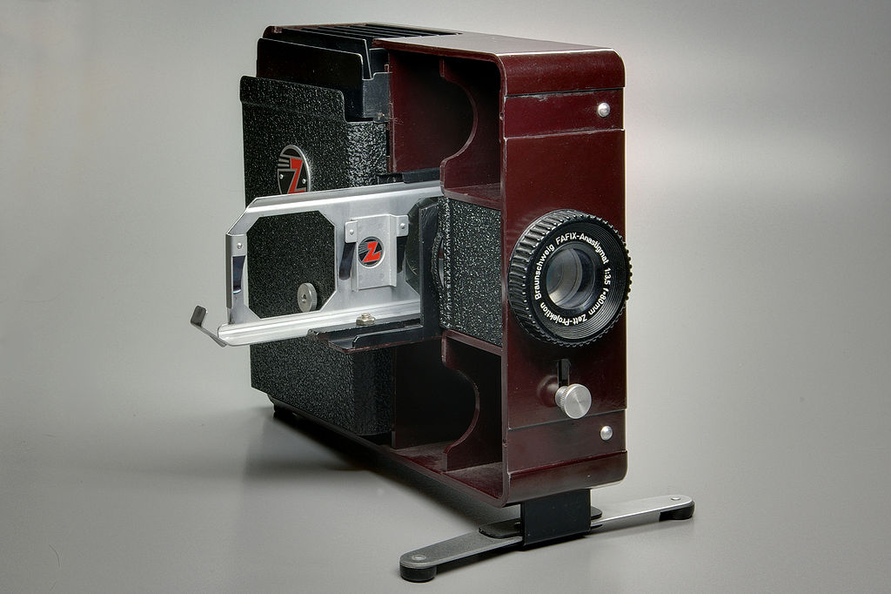
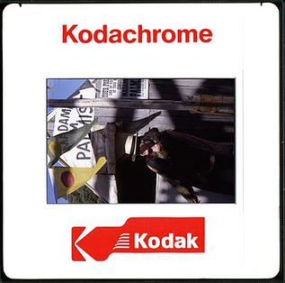
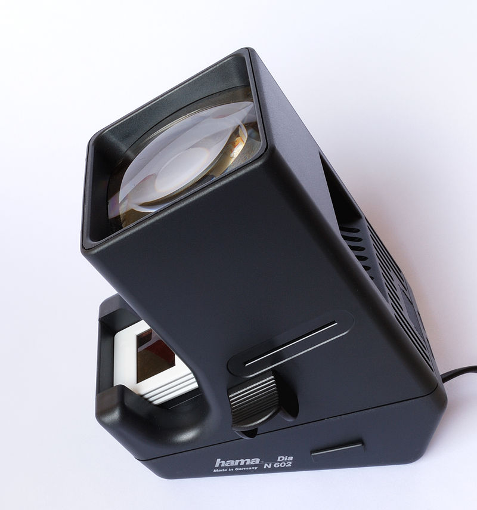

# Slides35
 

Slides35 is a Python 3 module for generating 35mm slide PNG images from SVG templates.
Such slides can be nice for back-in-time presents or Art exhibitions.

35mm = 1+3⁄8 or 1.375 inches refers to a famous [reversal (or slide) "positive" film size](https://en.wikipedia.org/wiki/Reversal_film).



[Zett Fafix Diaprojektor with double slide carrier (credits Berthold Werner, public domain)](https://en.wikipedia.org/wiki/Reversal_film#/media/File:Zett_Fafix_BW_1.JPG)

## TL;DR
To prepare slides for transfer by one of the third-party companies listed below, make or reuse our 24x36mm (or width/height = 3/2 ratio) SVG template and run this script (see **usage** below). This is adapted for 2x2 inches (5x5cm) slide mounts.

## Usage
Run the following for details:

`python slides35.py --help`

Examples:
```sh
python slides35.py --template templates/36x24mmNumbered.svg --id 1 --picture templates/24x36mmImage.png

python slides35.py --template templates/36x24mmNumbered.svg --id 1 --picture templates/24x36mmImage.png --output myslide.svg

python slides35.py --template templates/36x24mmNumbered.svg --id 1 --picture templates/24x36mmImage.png --output myslide.png # default DPI is 500

python slides35.py --template templates/36x24mmNumbered.svg --id 1 --picture templates/24x36mmImage.png --output myslide.png --dpi 400

python slides35.py --template templates/36x24mmNumbered.svg --id 1 --picture templates/24x36mmImage.png --output myslide.png --output-dir=any/directory/which/may/not/exist/yet
```

## About digital picture transfer onto slides
That script helps in the preparatory steps for digital picture transfer onto a transparent surface for 5x5cm slides making (where the picture is 24x36mm).
[That picture to slides transfer technique is explained on the WeAreProjectors website (by Clément Briend).](http://weareprojectors.com/digitalslide/?lang=en#transfertTab) The latter page also lists companies able to transfer pictures onto slides for you, if you preferred not to print them yourself on transparent paper with an inkjet printer.

## About the Kodachrome 35mm slide
The standard Kodachrome mount (ie. surrounding frame) size is 2”x2” (inches, or 5.08x5.08cm).
It embeds a 24x36mm image.



Source: [Unknown, Wikimedia](https://en.wikipedia.org/wiki/File:Kodachrome_slide_mount_1990s.jpg)

[Many more Kodachrome slides formats are listed on this KODAK blog page.](https://kodakdigitizing.com/blogs/news/how-to-tell-which-type-of-slides-you-have)

## About slides viewers


[Simple portable slide viewer - credit Harke - public domain](https://en.wikipedia.org/wiki/Slide_viewer#/media/File:Diabetrachter_Hama.jpg)

There are simple slides viewer on the market for less than 60$ or more caroussel-like ones (often second-hand). More advanced devices allow to scan old slides, but this is more and expensive and not what we want here.

One example of such viewers is the [KODAK 35mm Slide and Film Viewer](https://www.kodak.com/en/consumer/product/printing-scanning/film-scanners/kodak-35mm-slide-and-film-viewer).

## Requirements
`slides35` has no third-party libraries, it should work with Python 3.7 or later, or even earlier.
For `png` output, you need to install the `convert` executable (by ImageMagick).

## Testing
First `pip install -r test-requirements.txt`.

Run `python -m pytest tests.py` or `make tests`.
